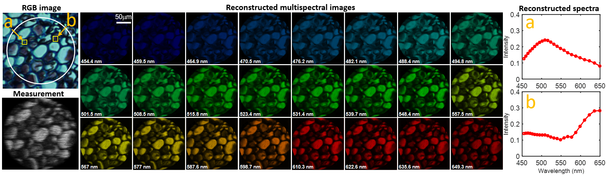
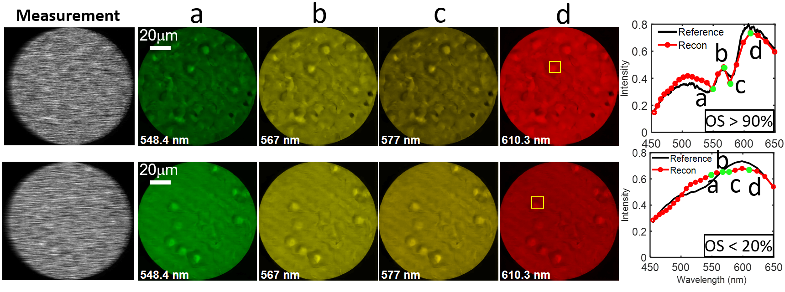

# Snapshot Multispectral Endomicriscopy (SMEM)
This repository contains the codes for paper **Snapshot Multispectral Endomicriscopy** (***Optics Letter (2020)***) by [Ziyi Meng](https://github.com/mengziyi64), Mu Qiao, Jiawei Ma, Zhenming Yu, Kun Xu, [Xin Yuan](https://www.bell-labs.com/usr/x.yuan).
[[pdf]](https://www.osapublishing.org/DirectPDFAccess/3261290B-4E1F-4952-97BCC064EEBA001D_ads393213.pdf?da=1&adsid=393213&journal=3&seq=0&mobile=no)

## Overviewer
This source code provides a end-to-end DNN for the reconstruction of multisprctral endomicroscopy images captured by a snapshot compressiver imager. This snapshot compressiver imager is based on [SD-CASSI](https://www.osapublishing.org/ao/abstract.cfm?uri=ao-47-10-B44) prototype system, in which 3D spectral cubes can be recovered from captured 2D compressive measurements by optimazation algorithms or DNNs. The real cuptured data has been included in this repository.

## Results

Fig. 1 Reconstructed multispectral images of a fern root section. Left: an RGB image (top) and the compressed measurement (bottom) of the sample. Middle: multispectral images with 24 spectral channels reconstructed from the developed DNN model. Right: reconstructed spectra of two selected regions indicated in the RGB image.

Fig. 2 Imaging results of blood sample. Upper row: reconstruction of fresh blood sample. lower row: reconstruction of the blood sample settled in the air for 5 minutes. The oxygen
saturation (OS) of the selected regions were calculated using the reconstructed spectra. A reconstructed hyperspectral video of moving red blood cells is shown in [Video1].
